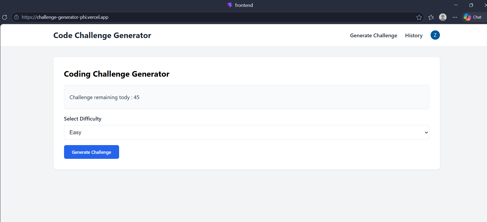
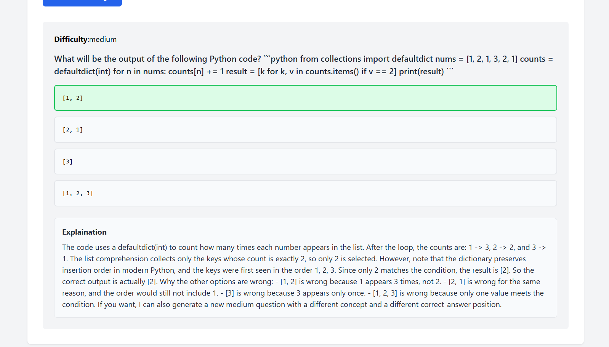
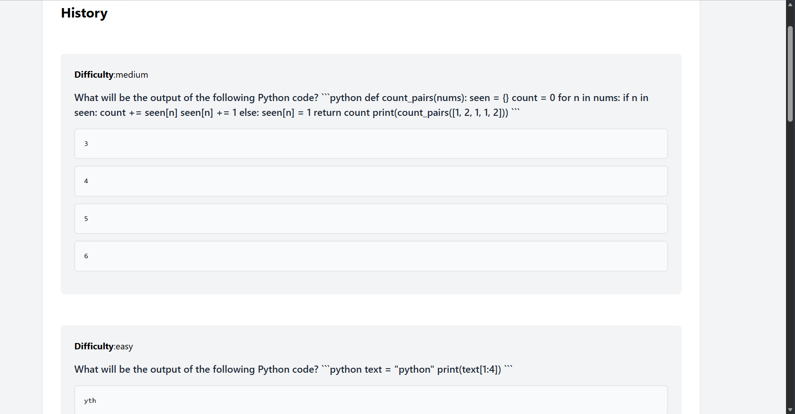

# Challenge Generator

## Map (Content)

- Frontend
- Backend

## Backend

- I have use FastAPI, openai, Clerk_backend

- I used FastAPI to create an API which connect my frontend to represent the question of the AI and Get the answer of the user to determine if it correct
- I used sqlalchemy to create and db has 2 tables to save everything of user 
- I used webhook of clerk to access this db to add the information when new user create an account

## Discover Backend directory

- server , req..txt, database, src, ai generator
- src has database and this folder has the code of create db and access it
- routes has a routes which will get the information from them

## Frontend

- it has the file of main vital of react
- I created src which has the following folders
#### auth
- auth folder has the auth of clerk to sign in and sign up
#### challenge
- challenge has the code of represent challenge and represent the MCQ and check
#### history 
- it access db to present all the questions of the user
#### layout 
- it has the code of layout of pages
#### utils 
- we use it to access the backend and connect them together

# Demo
- https://challenge-generator-phi.vercel.app/

# installation
- no requiered just visit the demo

# Screen Shots

---

---

